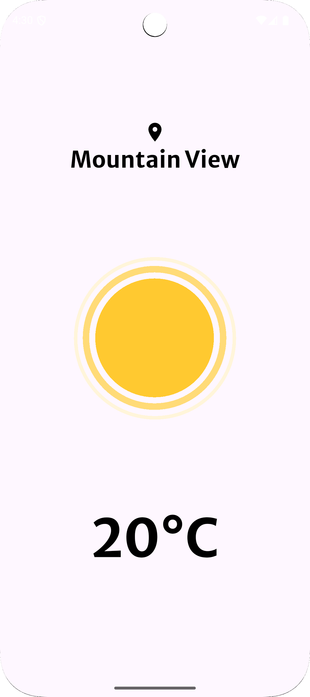
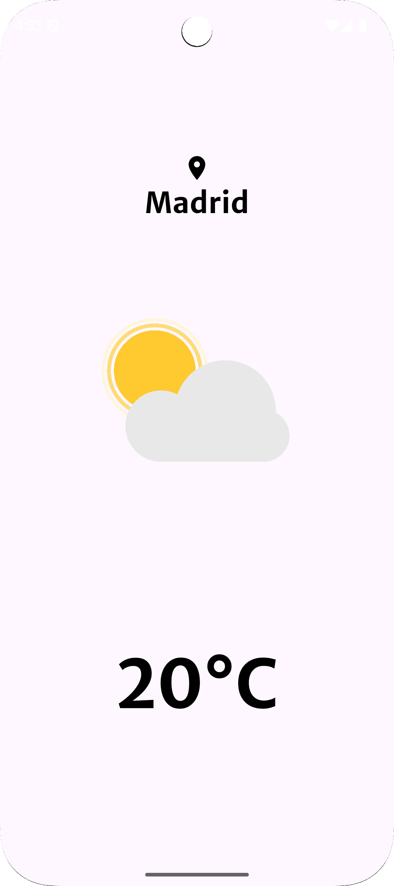
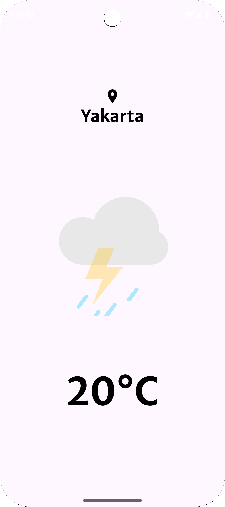

# Simple Weather App

Simple Weather App is a Flutter application that displays the current weather of your location. It uses geolocation services and a weather API to fetch and display relevant information, such as temperature, city name, and animations related to weather conditions.





## Features

- **Geolocation**: Automatically detects your current location.
- **Weather API**: Fetches real-time weather data.
- **Animations**: Displays dynamic animations based on weather conditions.
- **Custom Interface**: Uses Google Fonts and modern design for an appealing visual experience.

## Prerequisites

- Flutter SDK `^3.7.2`
- Dart SDK
- A valid API key for the weather service (e.g., OpenWeatherMap).

## Installation

1. Clone this repository:
   ```bash
   git clone https://github.com/juangdanilo/simple_weather.git
   cd simple_weather

2. Install dependencies:  
```bash
   flutter pub get
   ```
3. Configure your API key in the ```weather_service.dart```file:
```dart
final _weatherService = WeatherService('YOUR_API_KEY');
```
4. Run the application:
```bash
   flutter run
   ```

## Project Structure

- `lib/Pages/weather_page.dart`: Home page showing the current weather.
- `lib/weather_services/weather_service.dart`: Service to interact with the weather API.
- `lib/weather_models/weather_model.dart`: Data model for climate information.
- `assets/`: Contains Lottie animations for weather conditions.

## Dependencies

- **Flutter**: Core SDK.
- **cupertino_icons**: iOS-style icons.
- **http**: For making HTTP requests.
- **geolocator**: For obtaining the user's location.
- **geocoding**: For converting coordinates to city names.
- **lottie**: For dynamic animations.
- **google_fonts**: For custom fonts.

## Use

1. Open the app.
2. Allow location access.
3. View the current weather, including temperature, city name, and a representative animation.

## Resources

- [Flutter Documentation](https://flutter.dev/docs)
- [OpenWeatherMap API](https://openweathermap.org/api)

## Licence

This project is released under The Unlicense - free for any use.